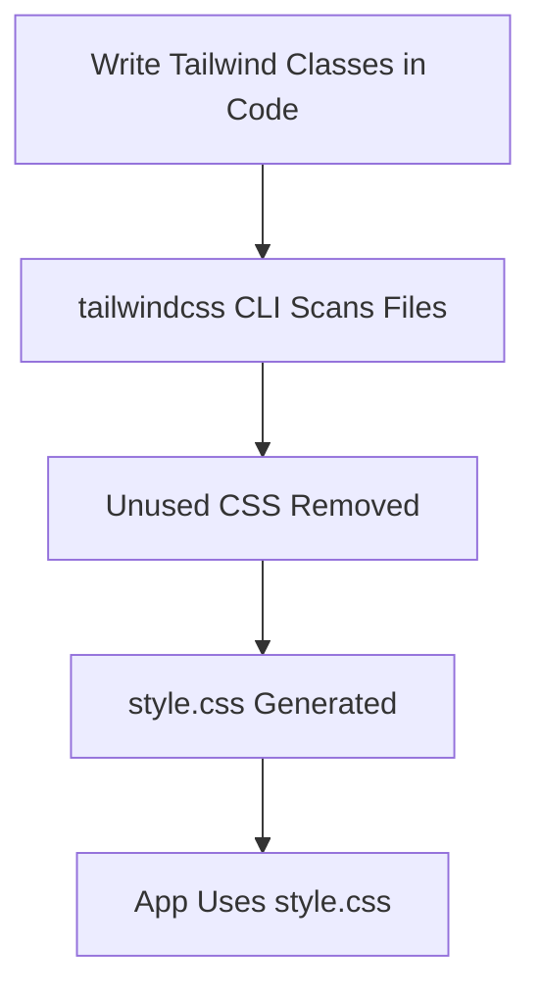
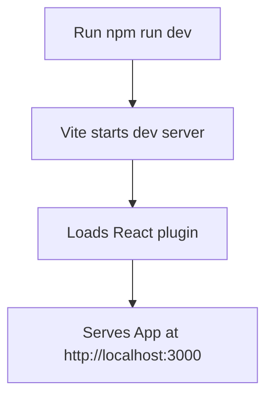
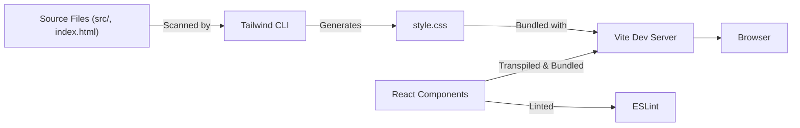

# 📚 Project Documentation

This documentation describes the configuration and setup of a **Vite + React** project with Tailwind CSS and ESLint, providing insights into each config and lock file. You will find detailed explanations of purpose, structure, and usage for each file, including diagrams and best practices.


## tailwind.config.js

This file configures **Tailwind CSS**, a utility-first CSS framework.

### Purpose

- Specifies which files Tailwind should scan for class names (purging).
- Allows customization of the Tailwind theme and plugins.

### Example Content

```js
module.exports = {
  content: ["./index.html", "./src/**/*.{js,ts,jsx,tsx}"],
  theme: { extend: {} },
  plugins: [],
};
```

### Description

- **content**: 
  - Looks for Tailwind classes in `index.html` and all JS/TS/JSX/TSX files under `src/`.
- **theme.extend**: 
  - Allows you to add custom theme values without overwriting defaults.
- **plugins**: 
  - No additional Tailwind plugins are registered.

### Flow: CSS Build Process



---

## eslint.config.js

This file provides an advanced ESLint configuration for linting your JavaScript and React code.

### Purpose

- Lints the codebase for code quality and style.
- Applies React-specific linting rules.
- Ignores build outputs.

### Example Content

```js
import js from '@eslint/js'
import globals from 'globals'
import reactHooks from 'eslint-plugin-react-hooks'
import reactRefresh from 'eslint-plugin-react-refresh'
import { defineConfig, globalIgnores } from 'eslint/config'

export default defineConfig([
  globalIgnores(['dist']),
  {
    files: ['**/*.{js,jsx}'],
    extends: [
      js.configs.recommended,
      reactHooks.configs['recommended-latest'],
      reactRefresh.configs.vite,
    ],
    languageOptions: {
      ecmaVersion: 2020,
      globals: globals.browser,
      parserOptions: {
        ecmaVersion: 'latest',
        ecmaFeatures: { jsx: true },
        sourceType: 'module',
      },
    },
    rules: {
      'no-unused-vars': ['error', { varsIgnorePattern: '^[A-Z_]' }],
    },
  },
])
```

### Configuration Highlights

- **globalIgnores(['dist'])**: Ignores the `dist` directory.
- **files**: Applies rules to all JS and JSX files.
- **extends**: 
  - `@eslint/js` recommended rules.
  - React Hooks best practices.
  - React Refresh rules for Vite.
- **languageOptions**: 
  - Latest ECMAScript.
  - Browser globals.
  - JSX parsing.
- **rules**: 
  - Errors on unused variables unless they are ALL_CAPS (often used for constants).

---

## package.json

This is the main **Node.js manifest** for your project, defining scripts, dependencies, and metadata.

### Purpose

- Lists project dependencies and devDependencies.
- Defines npm scripts for running, building, and linting.
- Declares project metadata.

### Example Content

```json
{
  "name": "react",
  "private": true,
  "version": "0.0.0",
  "type": "module",
  "scripts": {
    "dev": "vite",
    "tailwindcss": "npx @tailwindcss/cli -i ./src/tailwind.css -o ./src/style.css --watch",
    "build": "vite build",
    "lint": "eslint .",
    "preview": "vite preview"
  },
  "dependencies": {
    "@tailwindcss/cli": "^4.1.11",
    "axios": "^1.11.0",
    "framer-motion": "^12.23.12",
    "lucide-react": "^0.539.0",
    "react": "^19.1.0",
    "react-dom": "^19.1.0",
    "recharts": "^3.1.1",
    "tailwindcss": "^4.1.11"
  },
  "devDependencies": {
    "@eslint/js": "^9.30.1",
    "@types/react": "^19.1.8",
    "@types/react-dom": "^19.1.6",
    "@vitejs/plugin-react": "^4.6.0",
    "eslint": "^9.30.1",
    "eslint-plugin-react-hooks": "^5.2.0",
    "eslint-plugin-react-refresh": "^0.4.20",
    "globals": "^16.3.0",
    "vite": "^7.0.4"
  }
}
```

### Key Scripts

| Script        | Command                                                                 | Purpose                        |
|---------------|------------------------------------------------------------------------|--------------------------------|
| `dev`         | `vite`                                                                  | Start dev server               |
| `tailwindcss` | `npx @tailwindcss/cli -i ./src/tailwind.css -o ./src/style.css --watch` | Build Tailwind CSS in watch    |
| `build`       | `vite build`                                                            | Bundle app for production      |
| `lint`        | `eslint .`                                                              | Lint all JS/JSX files          |
| `preview`     | `vite preview`                                                          | Preview production build       |

### Main Dependencies

| Name            | Purpose                                            |
|-----------------|---------------------------------------------------|
| react, react-dom| UI library for building interfaces                 |
| tailwindcss     | Utility-first CSS framework                        |
| @tailwindcss/cli| CLI for Tailwind CSS processing                    |
| axios           | HTTP requests                                      |
| framer-motion   | Animation library                                  |
| lucide-react    | Icon set for React                                 |
| recharts        | Charting library                                   |

### Dev Dependencies

| Name                      | Purpose                               |
|---------------------------|---------------------------------------|
| eslint, @eslint/js        | Linting JavaScript                    |
| @types/react, @types/react-dom | TypeScript types for React        |
| @vitejs/plugin-react      | Vite plugin for React Fast Refresh    |
| globals                   | Provides browser global variables     |
| vite                      | Build tool and dev server             |

### Installation

```packagemanagers
{
  "commands": {
    "npm": "npm install",
    "yarn": "yarn install", 
    "pnpm": "pnpm install",
    "bun": "bun install"
  }
}
```

---

## index.html

This is the **entry HTML file** for your React application.

### Purpose

- Provides a container for the React app.
- Loads the main JavaScript entry point.
- Sets up essential HTML metadata.

### Example Content

```html
<!doctype html>
<html lang="en">
<head>
  <meta charset="UTF-8" />
  <link rel="icon" type="image/svg+xml" href="/vite.svg" />
  <meta name="viewport" content="width=device-width, initial-scale=1.0" />
  <title>Vite + React</title>
</head>
<body>
  <div id="root"></div>
  <script type="module" src="/src/main.jsx"></script>
</body>
</html>
```

### Description

- **lang="en"**: Sets document language.
- **favicon**: Uses Vite’s SVG for tab icon.
- **viewport**: Ensures mobile responsiveness.
- **#root div**: React app mounts here.
- **main.jsx**: Main entry point for React app.

---

## vite.config.js

This file configures **Vite**, the modern frontend build tool and dev server.

### Purpose

- Enables React Fast Refresh and JSX support.
- Configures development server host and port.

### Example Content

```js
import { defineConfig } from 'vite'
import react from '@vitejs/plugin-react'

export default defineConfig({
  plugins: [react()],
  server: {
    host: "0.0.0.0",
    port: 3000
  }
})
```

### Description

- **plugins: [react()]**: Adds React plugin for JSX and HMR support.
- **server.host: "0.0.0.0"**: Makes the dev server accessible on your local network.
- **server.port: 3000**: Sets development server to port 3000.

### Development Server Startup Flow



---

## package-lock.json

This is the **npm package lockfile**. 

### Purpose

- Locks the exact package versions for reproducible builds.
- Records dependency tree and integrity hashes.

### Description

- **Generated automatically by npm**.
- Ensures all developers use the same dependency versions.
- Not meant for manual editing.

### Example Structure

```json
{
  "name": "react",
  "version": "0.0.0",
  "lockfileVersion": 3,
  "requires": true,
  "packages": {
    ...
  }
}
```

### Best Practices

- Always commit `package-lock.json` to version control.
- Run `npm install` after pulling new changes with an updated lockfile.

---

## 🧩 Project Architecture Overview

### Overall Tooling and Build Flow



---

## 🚦 Development Workflow

1. **Write React code in `src/`**.
2. **Use Tailwind classes in your JSX**; Tailwind CLI generates CSS.
3. **Run `npm run dev`** to start Vite dev server with React Fast Refresh.
4. **Edit code and see live reload on `localhost:3000`**.
5. **Run `npm run lint`** to catch code issues early.
6. **Build for production using `npm run build`**.

---

## 🔒 Security and Modern Practices

- All dependencies are version-locked.
- Linting ensures code quality and prevents common bugs.
- Modern build tools (Vite, Tailwind, ESLint) for fast, reliable development.
- Minimal custom config for maintainability.

---

## 🎯 Summary Table

| File               | Role/Job                                             |
|--------------------|-----------------------------------------------------|
| `deepdocs.yml`     | Documentation generator config                      |
| `tailwind.config.js`| Tailwind CSS config                                |
| `eslint.config.js` | ESLint code linting config                          |
| `package.json`     | Project manifest, dependencies, scripts             |
| `index.html`       | Main HTML entry for React app                       |
| `vite.config.js`   | Vite build/dev server config                        |
| `package-lock.json`| Exact dependency versions (autogenerated)           |

---

## 🏁 Conclusion

This Vite + React starter is set up for fast development, strong code quality, and beautiful styling—ready for modern app building. You can easily extend it by adding more dependencies, customizing configs, and leveraging the robust toolchain for scalable React applications.
